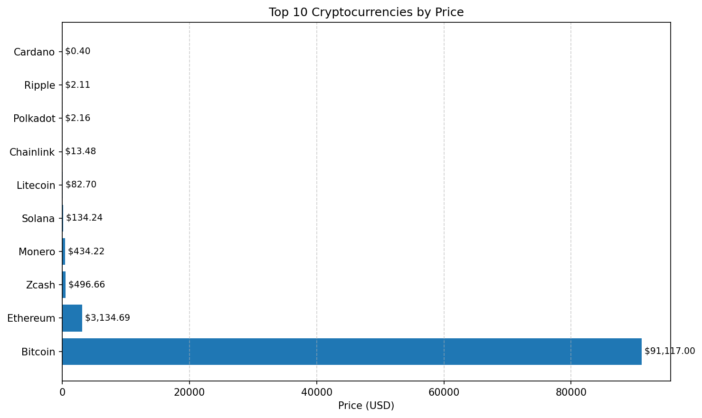

# Daily Crypto Commit

This repository automatically fetches cryptocurrency prices daily at 12:00 PM UTC and commits them to the repository. The purpose is to maintain a historical record of cryptocurrency prices and maintain an active commit history for GitHub contribution purposes.

## How it Works

- A GitHub Action workflow runs daily at 12:00 PM UTC
- The workflow fetches current prices for popular cryptocurrencies from CoinGecko API
- Prices are saved to JSON files in the repository
- The files are committed and pushed to the repository
- The workflow then completes and waits until the next scheduled run

## Files Generated

- `latest_crypto_prices.json` - Contains the most recent cryptocurrency prices
- `crypto_prices_YYYYMMDD.json` - Daily price snapshots with date-specific filenames

## Cryptocurrencies Tracked

The script tracks the following cryptocurrencies:
- Bitcoin (BTC)
- Ethereum (ETH)
- Cardano (ADA)
- Solana (SOL)
- Ripple (XRP)
- Dogecoin (DOGE)
- Polkadot (DOT)
- Litecoin (LTC)
- Chainlink (LINK)
- Stellar (XLM)

## Price Chart

## Statistics

- **Total cryptocurrencies tracked**: 15
- **Highest priced crypto**: Bitcoin ($84,221.00)
- **Lowest priced crypto**: VeChain ($0.01)
- **Biggest gainer**: Bitcoin (+0.00%)
- **Biggest loser**: Bitcoin (0.00%)
## GitHub Action Configuration

The workflow is configured in `.github/workflows/daily-crypto.yml` and is scheduled to run using cron syntax: `0 12 * * *` (12:00 PM UTC daily).

<!-- CRYPTO_PRICES_START -->
## Latest Cryptocurrency Prices

| Cryptocurrency | Symbol | Price (USD) | 24h Change | Price Change (vs Yesterday) | Market Cap |
|--------------|--------|-------------|------------|---------------------------|------------|
| Bitcoin | BITCOIN | $91,117.00 | N/A | +0.00% | N/A |
| Ethereum | ETHEREUM | $3,134.69 | N/A | +0.00% | N/A |
| Cardano | CARDANO | $0.40 | N/A | +0.00% | N/A |
| Solana | SOLANA | $134.24 | N/A | +0.00% | N/A |
| Ripple | RIPPLE | $2.11 | N/A | +0.00% | N/A |
| Dogecoin | DOGECOIN | $0.15 | N/A | +0.00% | N/A |
| Polkadot | POLKADOT | $2.16 | N/A | +0.00% | N/A |
| Litecoin | LITECOIN | $82.70 | N/A | +0.00% | N/A |
| Chainlink | CHAINLINK | $13.48 | N/A | +0.00% | N/A |
| Stellar | STELLAR | $0.23 | N/A | +0.00% | N/A |
| Monero | MONERO | $434.22 | N/A | +0.00% | N/A |
| Algorand | ALGORAND | $0.14 | N/A | +0.00% | N/A |
| VeChain | VECHAIN | $0.01 | N/A | +0.00% | N/A |
| Ontology | ONTOLOGY | $0.06 | N/A | +0.00% | N/A |
| Zcash | ZCASH | $496.66 | N/A | +0.00% | N/A |

*Last updated: 2026-01-04 12:56:06 UTC*
<!-- CRYPTO_PRICES_END -->